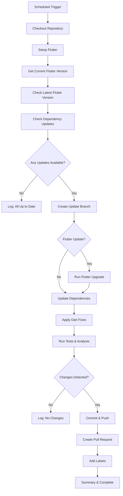

# Flutter Auto-Upgrade GitHub Action

A comprehensive GitHub Actions workflow that automatically checks for Flutter updates and critical dependency updates weekly, creating pull requests when updates are available.

## 🚀 Features

### Core Functionality
- **Weekly Scheduled Checks**: Automatically runs every Sunday at 2 AM UTC
- **Manual Trigger**: Can be triggered manually via GitHub Actions UI
- **Smart Version Detection**: Fetches latest stable Flutter release from GitHub API
- **Dependency Updates**: Checks for dio and http package updates via pub.dev API
- **Intelligent Change Detection**: Only creates PRs when actual changes exist after upgrade
- **Robust Upgrade Process**: Uses fallback to `flutter upgrade --force` if normal upgrade fails

### Advanced Capabilities
- **Multi-Package Support**: Handles Flutter, dio, and http updates independently or combined
- **Automatic Deprecation Fixes**: Applies `dart fix --apply` to handle breaking changes
- **Comprehensive Testing**: Runs `flutter analyze` and `flutter test` after upgrade
- **Detailed PR Creation**: Creates informative pull requests with upgrade summaries
- **Auto-Labeling**: Automatically labels PRs with relevant tags
- **Error Handling**: Graceful error handling with detailed logging

## 📋 Workflow Overview



## 📁 File Structure

The workflow is located at:
```
.github/workflows/flutter-upgrade.yml
```

## ⚙️ Configuration

### Schedule Configuration
The workflow runs on a weekly schedule:
```yaml
on:
  schedule:
    # Run every Sunday at 2 AM UTC
    - cron: '0 2 * * 0'
  workflow_dispatch: # Allow manual triggering
```

### Permissions Required
```yaml
permissions:
  contents: write      # For creating branches and commits
  pull-requests: write # For creating and labeling PRs
```

### Environment Variables
The workflow automatically sets these environment variables:
- `BRANCH_NAME`: Name of the upgrade branch (e.g., `flutter/auto-upgrade-3.16.0`)
- `CURRENT_VERSION`: Current Flutter version in the project
- `LATEST_VERSION`: Latest available Flutter stable version
- `DIO_VERSION`: Current dio package version in the project
- `HTTP_VERSION`: Current http package version in the project
- `LATEST_DIO_VERSION`: Latest available dio package version
- `LATEST_HTTP_VERSION`: Latest available http package version

## 🔧 How It Works

### 1. Version Detection
```bash
# Get current Flutter version
CURRENT_VERSION=$(flutter --version | head -n 1 | grep -oE '[0-9]+\.[0-9]+\.[0-9]+')

# Get latest stable version from GitHub API
LATEST_VERSION=$(curl -s https://api.github.com/repos/flutter/flutter/releases/latest | grep -oP '"tag_name": "\K[^"]*')

# Get current dio and http package versions
DIO_VERSION=$(dart pub deps --json | jq -r '.packages[] | select(.name == "dio") | .version')
HTTP_VERSION=$(dart pub deps --json | jq -r '.packages[] | select(.name == "http") | .version')

# Get latest dio and http package versions from pub.dev API
LATEST_DIO_VERSION=$(curl -s https://pub.dev/api/packages/dio | jq -r '.latest.version')
LATEST_HTTP_VERSION=$(curl -s https://pub.dev/api/packages/http | jq -r '.latest.version')
```

### 2. Robust Upgrade Process
```bash
# Try normal upgrade first, fallback to force upgrade
if ! flutter upgrade; then
  echo "Normal upgrade failed, attempting force upgrade..."
  flutter upgrade --force
fi

# Update dio and http packages
dart pub upgrade dio:$LATEST_DIO_VERSION http:$LATEST_HTTP_VERSION
```

### 3. Automatic Deprecation Fixes
```bash
# Check and apply automatic fixes
dart fix --dry-run
dart fix --apply
```

### 4. Change Detection
```bash
git add .
if git diff --staged --quiet; then
  echo "has_changes=false"
else
  echo "has_changes=true"
fi
```

### 5. Quality Assurance
```bash
flutter pub get
flutter doctor
flutter analyze
flutter test
```

## 📝 Pull Request Template

When changes are detected, the workflow creates a PR with:

### Title Format
```
chore: upgrade Flutter to [VERSION] and dependencies to [DIO_VERSION] and [HTTP_VERSION]
```

### PR Description Includes
- **Upgrade Summary**: From version X to version Y
- **Changes Made**: List of all automated actions performed
- **Review Checklist**: Items for manual review
- **Release Notes Link**: Direct link to Flutter release notes
- **Automation Notice**: Clear indication of automated creation

### Example PR Description
```markdown
## Flutter Auto Upgrade

This PR was automatically created to upgrade Flutter from **3.15.0** to **3.16.0**, dio from **4.0.0** to **4.0.1**, and http from **0.13.3** to **0.13.4**.

### Changes Made:
- Upgraded Flutter to the latest stable version
- Updated dio and http packages to the latest versions
- Updated dependencies with `flutter pub get`
- Applied automatic fixes for deprecations with `dart fix --apply`
- Used force upgrade fallback if normal upgrade failed
- Verified with `flutter analyze`
- Ran `flutter test` (check CI results)

### Review Checklist:
- [ ] Verify all tests pass in CI
- [ ] Check for any breaking changes in Flutter release notes
- [ ] Verify dio and http package compatibility with your AppDynamics plugin
- [ ] Test network request tracking after dependency updates
- [ ] Test the app manually if needed
- [ ] Review any dependency conflicts

### Flutter Release Notes:
Check the [Flutter releases page](https://github.com/flutter/flutter/releases/tag/3.16.0) for detailed information about this version.

### Package Release Notes:
- [Dio Release Notes](https://pub.dev/packages/dio/changelog)
- [HTTP Release Notes](https://pub.dev/packages/http/changelog)

---
*This PR was created automatically by the Flutter Auto Upgrade workflow.*
```

## 🏷️ Automatic Labels

PRs are automatically labeled with:
- `dependencies`
- `flutter`
- `automated`
- `upgrade`

## 🔍 Workflow Outputs

### Console Outputs
The workflow provides clear console output for each scenario:

#### No Updates Available
```
✅ Flutter is already up to date (3.16.0)
✅ All dependencies are up to date
```

#### Flutter Update Only
```
Flutter upgrade available, changes detected, and PR created!
Upgraded from 3.15.0 to 3.16.0
```

#### Dependency Updates Only
```
Dependency updates available, changes detected, and PR created!
Updated dio: 4.0.0 -> 4.0.1
Updated http: 0.13.3 -> 0.13.4
```

#### Combined Updates
```
Flutter upgrade available, changes detected, and PR created!
Upgraded from 3.15.0 to 3.16.0
Dependency updates also applied
```

#### Updates Available but No Changes
```
Flutter upgrade available, but no changes detected
Dependency updates available, but no changes detected
```

## 🚨 Error Handling

### Upgrade Failures
- Primary: `flutter upgrade`
- Fallback: `flutter upgrade --force`
- Both failures are logged with detailed error messages

### Dependency Update Failures
- pub.dev API failures are handled gracefully
- Package version parsing errors are logged
- Workflow continues with available information

### Test Failures
- Test failures don't stop the workflow
- Failures are logged and mentioned in PR description
- Manual review is recommended for failed tests

### API Failures
- GitHub API failures are handled gracefully
- pub.dev API failures for version checking are logged
- Workflow continues with available information

## 📊 Workflow Conditions

| Scenario | Flutter Update | Dependency Updates | Action Taken |
|----------|----------------|-------------------|--------------|
| No updates | ❌ | ❌ | Log message, skip |
| Flutter only | ✅ | ❌ | Create Flutter upgrade PR |
| Dependencies only | ❌ | ✅ | Create dependency update PR |
| Combined updates | ✅ | ✅ | Create combined upgrade PR |
| Updates but no file changes | ✅/❌ | ✅/❌ | Log "no changes" |
| API errors | ⚠️ | ⚠️ | Log error, continue |
| Upgrade errors | ⚠️ | ⚠️ | Try fallback, continue |

## 📦 Supported Dependencies

### Current Dependencies
The workflow currently monitors:
- **Flutter SDK**: Latest stable releases
- **dio**: HTTP client for network requests
- **http**: Standard HTTP client

### Why These Dependencies?
For the AppDynamics Flutter plugin:
- **dio**: Critical for `TrackedDioInterceptor` functionality
- **http**: Used in `TrackedHttpClient` for network tracking
- **Flutter**: Core framework compatibility

### Adding More Dependencies
To monitor additional packages, extend the dependency checking step:
```yaml
# Check new package version
NEW_PACKAGE_CURRENT=$(grep "new_package:" pubspec.yaml | sed 's/.*: \^//')
NEW_PACKAGE_LATEST=$(curl -s https://pub.dev/api/packages/new_package | jq -r '.latest.version')

# Add to update logic
if [ "$NEW_PACKAGE_CURRENT" != "$NEW_PACKAGE_LATEST" ]; then
  echo "New package update available: $NEW_PACKAGE_CURRENT -> $NEW_PACKAGE_LATEST"
  DEPS_AVAILABLE=true
fi
```

## 🎯 Benefits

### Automation
- ✅ **Zero Manual Intervention**: Fully automated weekly checks
- ✅ **Smart Detection**: Only acts when upgrades are available
- ✅ **Change Awareness**: Only creates PRs when files actually change

### Quality Assurance
- ✅ **Comprehensive Testing**: Runs analysis and tests after upgrade
- ✅ **Automatic Fixes**: Applies deprecation fixes automatically
- ✅ **Fallback Mechanisms**: Handles edge cases and failures

### Developer Experience
- ✅ **Detailed PRs**: Rich information for easy review
- ✅ **Clear Logging**: Comprehensive console output
- ✅ **Manual Override**: Can be triggered manually when needed

### Repository Health
- ✅ **Stay Updated**: Never miss Flutter releases
- ✅ **Clean History**: Only creates commits when necessary
- ✅ **Proper Branching**: Uses dedicated branches for upgrades

## 🔍 Troubleshooting

### Common Issues

#### Workflow Not Running
- Check if the workflow file is in `.github/workflows/`
- Verify the cron syntax is correct
- Ensure repository has Actions enabled

#### PR Creation Fails
- Check repository permissions for the GitHub token
- Verify `contents: write` and `pull-requests: write` permissions
- Check if branch protection rules allow PR creation

#### Tests Fail After Upgrade
- Review Flutter breaking changes in release notes
- Check if manual fixes are needed beyond automatic ones
- Consider updating dependencies that may be incompatible

#### No Changes Detected
- This is normal if Flutter upgrade doesn't change any files
- Indicates your project is already compatible with the new version
- No action needed, workflow is working correctly

### Getting Help
- Check workflow run logs in GitHub Actions tab
- Review Flutter release notes for breaking changes
- Check Flutter community resources for upgrade guides

## 📚 Related Documentation

- [Flutter Upgrade Guide](https://docs.flutter.dev/development/tools/sdk/upgrading)
- [GitHub Actions Documentation](https://docs.github.com/en/actions)
- [Dart Fix Tool Documentation](https://dart.dev/tools/dart-fix)
- [Flutter Release Notes](https://docs.flutter.dev/development/tools/sdk/releases)

## 🤝 Contributing

To modify or improve this workflow:

1. Edit `.github/workflows/flutter-upgrade.yml`
2. Test changes in a feature branch
3. Verify the workflow runs correctly
4. Update this documentation if needed
5. Create a pull request with your changes

---

**Created**: August 2025  
**Last Updated**: August 2025  
**Workflow Version**: 1.0  
**Compatible Flutter Versions**: All stable releases
